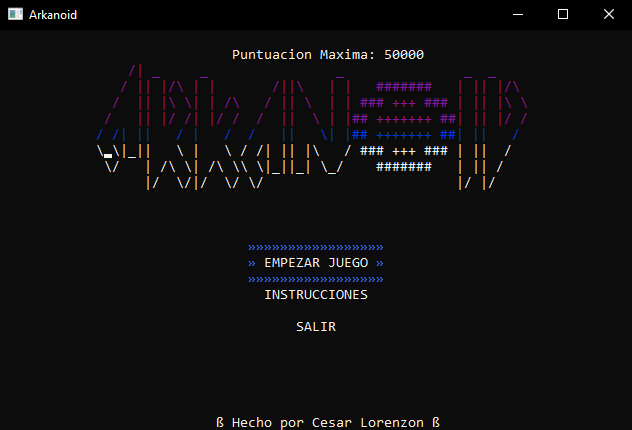
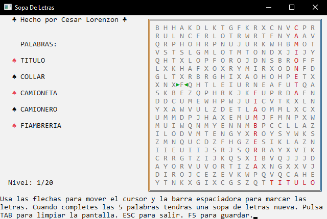
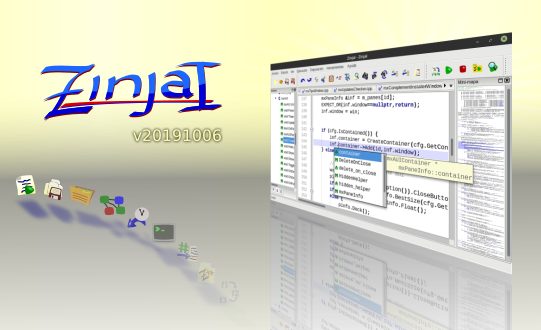
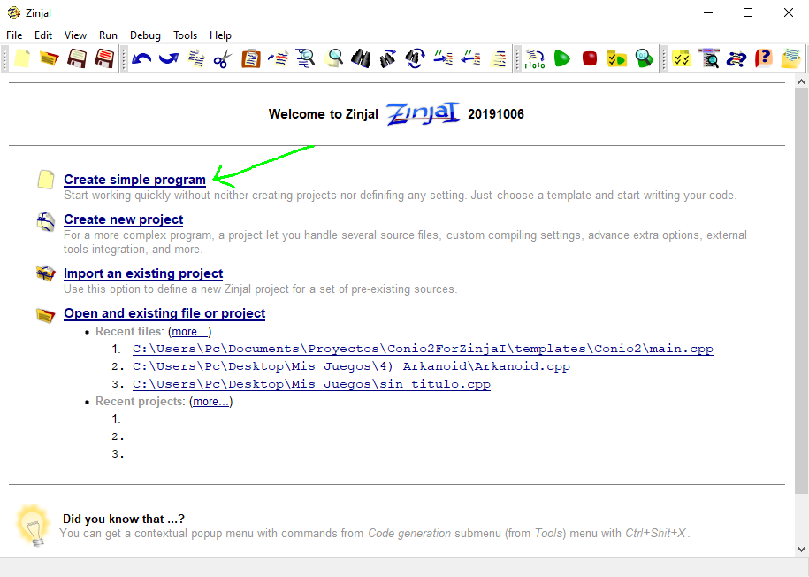
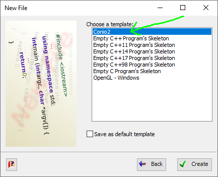
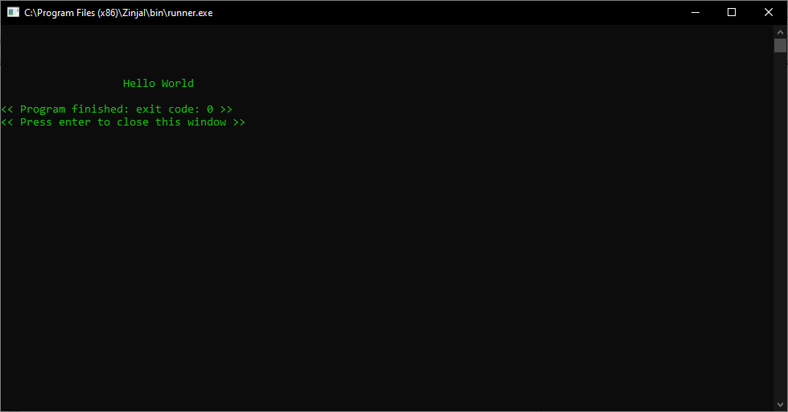
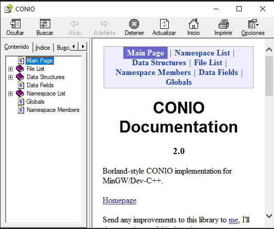
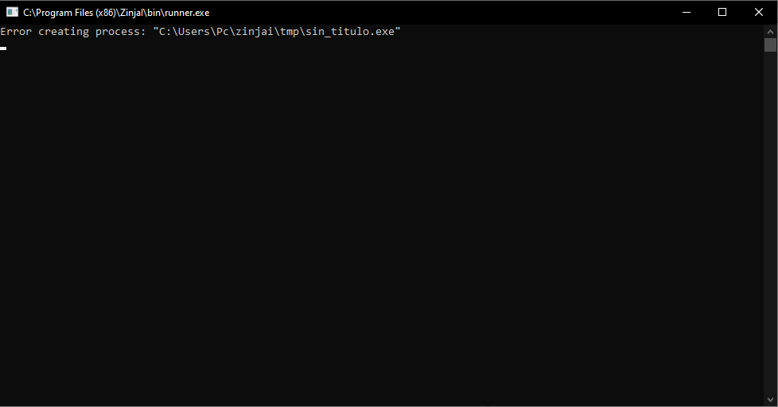
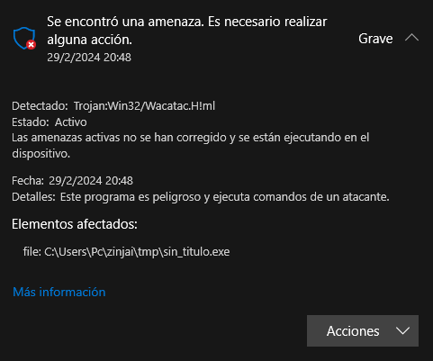
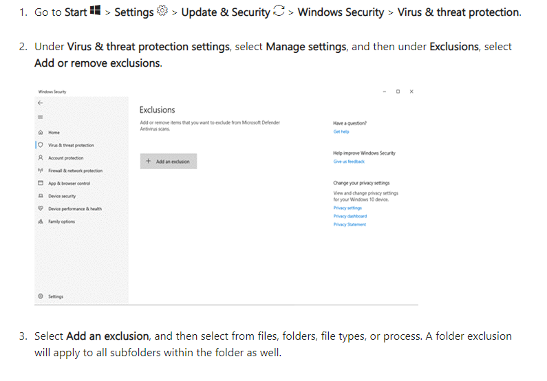

## Conio2 for ZinjaI

Toda la configuración necesaria para usar Conio2 en C++ con ZinjaI. Con esta librería, podrás elegir coordenadas dónde escribir y con qué colores en la consola, además de la opción de detectar inputs del teclado, para hacer juegos retro. O lograr resultados como estos:




---

Compatible con la versión 20191006 de ZinjaI.
[](https://zinjai.sourceforge.net/)<br>
Click en la imagen [o aquí](https://zinjai.sourceforge.net/) para ir a la página oficial para descargar ZinjaI.

## Instrucciones

Descargar el contenido del repositorio y arrastrar a la carpeta de instalación de ZinjaI. Reemplazar de ser necesario.

Para usar la librería simplemente cree un nuevo proyecto y elija la plantilla Conio2, o simplemente añada ``#include <conio2.h>`` en la cabecera de su proyecto C++.




Y ya podemos empezar a programar nuestros juegos retro. Copiar y pegar el siguiente bloque de código para testear que efectivamente Conio2 está funcionando.

```cpp
#include <iostream>
#include <conio2.h>
using namespace std;

int main(int argc, char *argv[]) {
	textcolor(LIGHTGREEN);
	gotoxy(20, 5);
	cout<<"Hello World";
	return 0;
}
```

Y esto es lo que deberíamos obtener como resultado.



## Documentation

La documentación de Conio2 está disponible en el archivo ``conio.chm``, en la raíz del proyecto<br>


## Posibles problemas

### Error creating process:


Si esto te pasa, probablemente ZinjaI en sí no te esté funcionando al ejecutar cualquier programa, con o sin Conio2.
La solución la podrás encontrar en el siguiente link, **pero continúa bajo tu propio riesgo**:

https://sourceforge.net/p/zinjai/discussion/errores_es/thread/9d7aa2c5/

En el primero de ellos, podremos leer la respuesta al problema de la mano del creador de ZinjaI, Zaskar, quien aclara que algunos antivirus (Incluído Windows Defender) pueden tomar al compilador como sospechoso y esto hace que borre automáticamente los .exe que ZinjaI genera. Y que la solución es agregar una exclusión al antivirus.

En mi caso, entré al Windows Defender, y me encontré con que estaba convencido de que esto era un troyano:
<br>
Si miran bien, es posible ver que el path al "archivo infectado", es justamente, la carpeta donde ZinjaI crea el .exe antes de ejecutarlo, o sea, **el programa que acabamos de crear**, y cuyo código puede ser tan simple como un Hello World.

El siguiente link explica cómo agregar una exclusión en Windows Defender, y en donde deberás añadir el path hasta la carpeta ``temp``, por ejemplo, en mi caso es ``C:\Users\Pc\zinjai\tmp``

https://support.microsoft.com/en-us/windows/add-an-exclusion-to-windows-security-811816c0-4dfd-af4a-47e4-c301afe13b26




## Credits

### ZinjaI:
* Pablo Novara <zaskar_84@yahoo.com.ar>
### Conio2:
 * Hongli Lai <hongli@telekabel.nl>
 * tkorrovi <tkorrovi@altavista.net> on 2002/02/26.
 * Andrew Westcott <ajwestco@users.sourceforge.net>
 * Michal Molhanec <michal@molhanec.net>


## Contact

If you have any questions, feel free to reach out to me. My contact data is in [LinkTree](https://linktr.ee/lorenzoncesar). César Lorenzon, Game Developer.