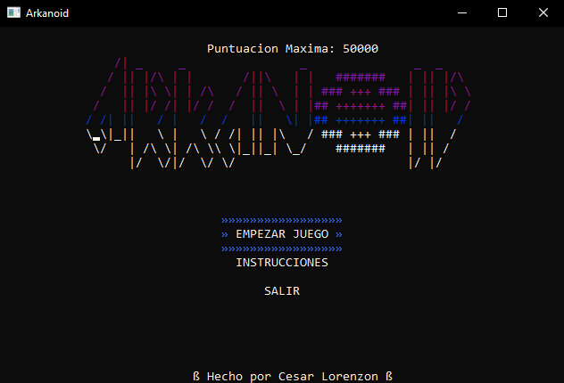
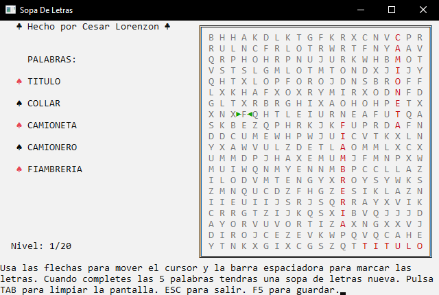
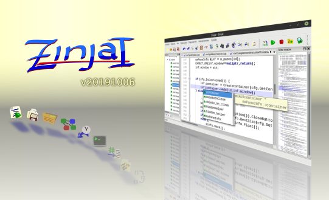
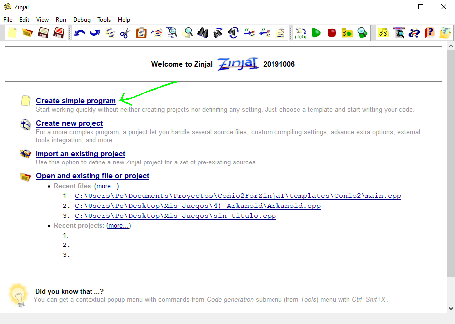
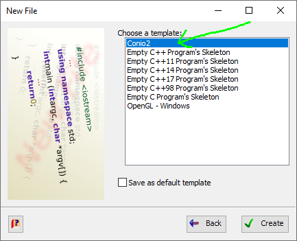
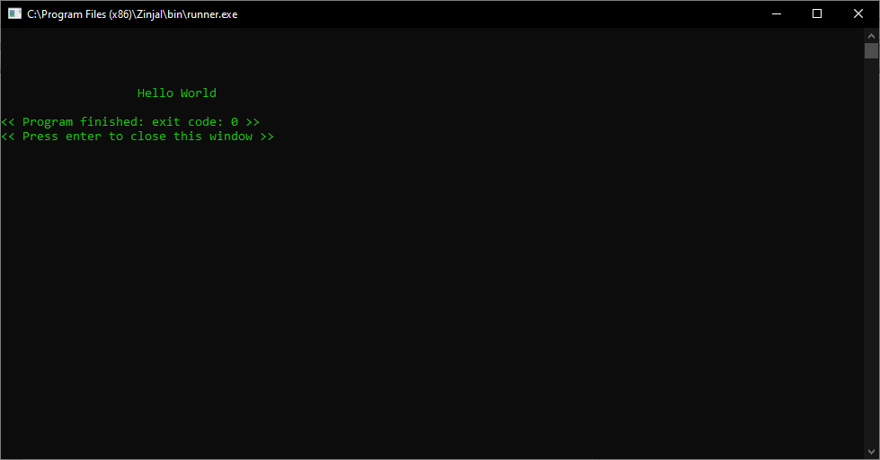
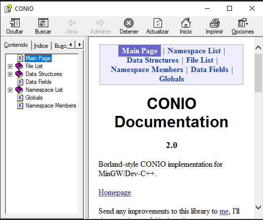
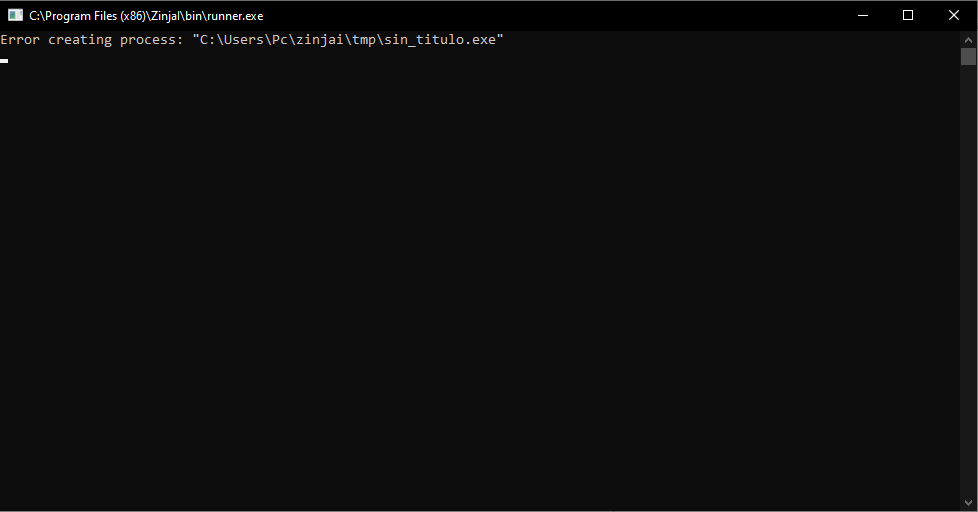
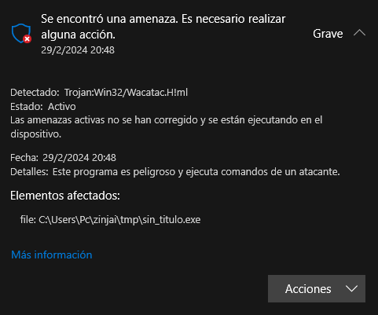
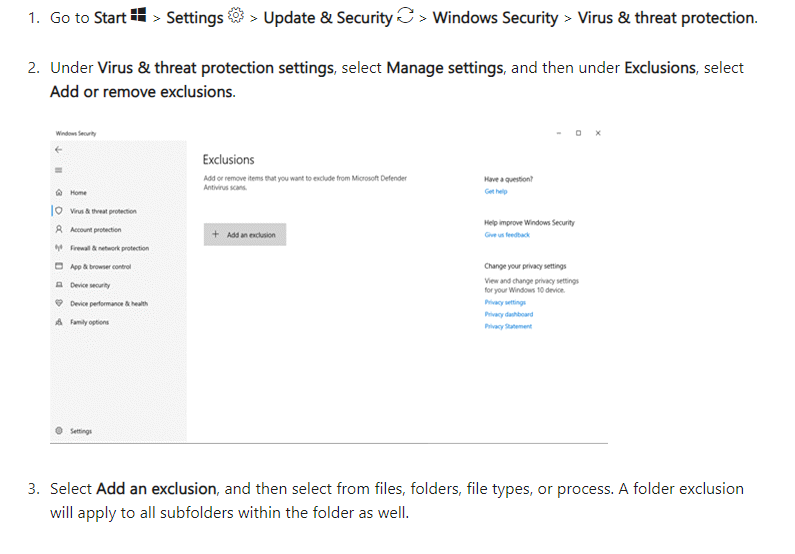

## Conio2 for ZinjaI

All the setup needed to use Conio2 in C++ with ZinjaI. With this library, you can choose coordinates where to write and with what colors in the console, as well as the option to detect keyboard inputs, to make retro games. Or achieve results like these:




---

Compatible with version 20191006 of ZinjaI.<br>
[](https://zinjai.sourceforge.net/)<br>
Click on the image [or here](https://zinjai.sourceforge.net/) to go to the official page to download ZinjaI.

## Instructions

Download the .zip file from "Releases" section and unzip it into the ZinjaI installation folder (which is usually ``C:\Program Files (x86)\ZinjaI``), replacing the files if necessary.
(The contents of that zip are the same as the contents of this repository, excluding the information from this README.md file)

The ZinjaI folder should look like this:


To use the library, simply create a new project and choose the Conio2 template, or just add ``#include <conio2.h>`` at the beginning of your C++ project header.




And now you can start programming your retro games. Copy and paste the following code block to test that Conio2 is indeed working:

```cpp
#include <iostream>
#include <conio2.h>
using namespace std;

int main(int argc, char *argv[]) {
	textcolor(LIGHTGREEN);
	gotoxy(20, 5);
	cout<<"Hello World";
	return 0;
}
```

And this is what we should expect as a result:



## Documentation

The documentation for Conio2 is available in the file ``conio.chm``, located in the root of the project<br>


## Possible issues

### Error creating process:


If this happens, ZinjaI itself might not be working for you when running any program, with or without Conio2.
The solution can be found at the following link, **but proceed at your own risk**:

https://sourceforge.net/p/zinjai/discussion/errores_es/thread/9d7aa2c5/

In this discussion forum, you'll find the answer to the problem from ZinjaI's creator, Zaskar, who explains that some antivirus programs (including Windows Defender) might flag the compiler as suspicious and automatically delete the .exe files generated by ZinjaI. The solution is to add an exclusion for the antivirus.

In my case, I accessed Windows Defender and found that it was convinced this was a Trojan:
(Yes, my OS is in Spanish)<br>

If you look closely, you can see that the path to the "infected file" is precisely the folder where ZinjaI creates the .exe before running it, in other words, the program we just created, and whose code could be as simple as a Hello World.

The following link explains how to add an exclusion in Windows Defender, where you'll need to add the path to the ``temp`` folder. For example, in my case, it's ``C:\Users\Pc\zinjai\tmp``

https://support.microsoft.com/en-us/windows/add-an-exclusion-to-windows-security-811816c0-4dfd-af4a-47e4-c301afe13b26



## Credits

### ZinjaI:
* Pablo Novara <zaskar_84@yahoo.com.ar>
### Conio2:
 * Hongli Lai <hongli@telekabel.nl>
 * tkorrovi <tkorrovi@altavista.net>
 * Andrew Westcott <ajwestco@users.sourceforge.net>
 * Michal Molhanec <michal@molhanec.net>

## Contact

If you have any questions, feel free to reach out to me. My contact data is in [LinkTree](https://linktr.ee/lorenzoncesar). César Lorenzon, Game Developer.
